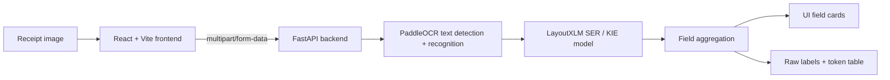

# FinRecon Receipt Extraction

FinRecon Receipt Extraction is an OCR and Key Information Extraction workbench for Vietnamese retail receipts. The project focuses on a narrow, practical computer vision problem: upload a receipt image, run OCR, classify receipt text into business fields, and inspect the model output honestly without rule-based fallback.

Current extraction targets:

| Field | Meaning |
| --- | --- |
| `SELLER` | Seller, merchant, store, or business name |
| `ADDRESS` | Seller address |
| `TIMESTAMP` | Transaction date or date/time |
| `TOTAL_COST` | Total paid amount |

The current version is intentionally scoped to model evaluation and field extraction. Earlier invoice automation, bank reconciliation, sample generation, and dashboard workflows have been removed from the active application so the repository can focus on OCR/KIE quality first.

## Table Of Contents

- [Project Goal](#project-goal)
- [Why This Project Matters](#why-this-project-matters)
- [Current Application](#current-application)
- [Architecture](#architecture)
- [Technology Stack](#technology-stack)
- [Model Pipeline](#model-pipeline)
- [Dataset Strategy](#dataset-strategy)
- [Repository Structure](#repository-structure)
- [Run Locally](#run-locally)
- [API Reference](#api-reference)
- [Training Workflow](#training-workflow)
- [Evaluation And Metrics](#evaluation-and-metrics)
- [Model Artifacts](#model-artifacts)
- [Git And Artifact Policy](#git-and-artifact-policy)
- [Roadmap](#roadmap)

## Project Goal

The goal is to build a focused receipt extraction system that can be used to test and improve OCR plus document understanding models for Vietnamese retail receipts.

The target workflow is:

1. Upload a receipt or sales slip image.
2. Choose an OCR engine.
3. Choose a KIE/SER model.
4. Run inference.
5. Review the four extracted fields.
6. Inspect raw OCR tokens and raw model labels to understand failures.

This is not currently a full accounting SaaS product. It is a practical research and engineering workbench for validating whether receipt images can be read and structured reliably enough before building higher-level finance workflows on top.

## Why This Project Matters

Vietnamese retail receipts are challenging for standard OCR systems:

- They often come from low-resolution phone photos or thermal printers.
- Text can be small, blurred, skewed, faded, or compressed.
- Vietnamese diacritics are frequently lost or confused.
- Receipt layouts vary heavily between merchants.
- Important values are mixed with context labels such as `Ngày bán`, `Tổng cộng`, `Thanh toán`, or `Địa chỉ`.

This project separates the problem into two stages:

- **OCR:** detect and recognize text from receipt images.
- **KIE/SER:** classify each OCR token or line into the correct business field.

That separation makes errors easier to diagnose. If the text is wrong, the issue is usually OCR recognition. If the text is correct but assigned to the wrong field, the issue is usually KIE/SER.

## Current Application

The web app is a single-page inference workbench.

Main interface features:

- Receipt image upload with local preview.
- OCR engine selector.
- KIE/SER model selector.
- Four field cards for `SELLER`, `ADDRESS`, `TIMESTAMP`, and `TOTAL_COST`.
- Raw SER output panel.
- OCR token table.
- Clear temporary upload/inference outputs.

Important design principle:

> The app does not use fallback regex or hand-written extraction rules in the model test path.

Post-processing is only used to normalize display values. For example, if the model labels a full line like `Ngày bán 23/08/2022 5:01:08CH`, the UI can display just the date/time value while still preserving the raw token output for debugging.

## Architecture



Runtime responsibilities:

| Layer | Responsibility |
| --- | --- |
| Frontend | Upload image, select models, show results and raw output |
| Backend | Receive image, manage temporary files, call OCR/KIE pipeline, normalize response |
| PaddleOCR | Text detection and text recognition |
| LayoutXLM/SER | Token-level field classification |
| Scripts | Dataset preparation, training, evaluation, and metric tracking |

## Technology Stack

### Frontend

- React 19
- Vite
- Tailwind CSS
- lucide-react icons

### Backend

- FastAPI
- Uvicorn
- Python
- Local file storage for temporary uploads and inference outputs

### Machine Learning

- PaddleOCR
- PaddlePaddle
- PaddleNLP
- LayoutXLM for SER/KIE
- MC-OCR 2021 based data preparation

### Tooling

- PowerShell scripts for Windows training workflow
- Separate Python environments for backend and PaddleOCR
- Local cache redirection to keep Paddle/PaddleNLP/HuggingFace cache inside the project drive

## Model Pipeline

The inference pipeline has two independent choices: OCR engine and KIE engine.

### OCR Options

| UI label | API value | Purpose |
| --- | --- | --- |
| PaddleOCR package default | `paddleocr_original` | Package-level baseline using PaddleOCR default behavior |
| PP-OCRv4 Chinese pretrained | `paddleocr_pretrained` | Official `lang=ch` pretrained baseline; useful for comparison but weak for Vietnamese diacritics |
| PP-OCRv4 Vietnamese/Latin pretrained | `paddleocr_vi_pretrained` | Official `lang=vi`/Latin-oriented pretrained OCR option |
| MC-OCR fine-tuned recognizer | `paddleocr_trained` | Project OCR recognizer fine-tuned from MC-OCR 2021 text recognition data |

### KIE/SER Options

| UI label | API value | Purpose |
| --- | --- | --- |
| LayoutXLM pretrained baseline | `kie_pretrained` | Baseline/debug option without project-specific 4-field fine-tuning |
| LayoutXLM-SER fine-tuned | `kie_trained` | Project checkpoint fine-tuned for `SELLER`, `ADDRESS`, `TIMESTAMP`, and `TOTAL_COST` |

### OCR vs KIE

These two stages solve different problems:

- PaddleOCR reads text from image regions.
- LayoutXLM/SER decides which business field each recognized text belongs to.

For example:

- If `Số tiền` is read as `So tien`, the issue is OCR recognition.
- If `So tien thanh toan 709.000` is correctly read but labeled as `OTHER`, the issue is KIE/SER.
- If the model labels `So tien thanh toan 709.000` as `TOTAL_COST` and the UI displays `709.000`, that is display normalization, not model cheating.

## Dataset Strategy

The project uses MC-OCR 2021 derived data for receipt understanding experiments.

Current label set:

```text
OTHER
SELLER
ADDRESS
TIMESTAMP
TOTAL_COST
```

Dataset policy:

- Keep the raw MC-OCR dataset read-only.
- Build prepared datasets under `archive/prepared/`.
- Keep both value lines and useful context lines for KIE.
- Do not demote `TOTAL_COST` only because a line has no amount.
- Do not demote `TIMESTAMP` only because a line has no date/time.
- Remove only genuinely unusable annotations such as empty text or invalid geometry.

This policy is important for KIE because context lines such as `Tổng cộng`, `Thanh toán`, `Ngày bán`, and `Thời gian` help the model understand nearby values.

## Repository Structure

```text
.
├── backend/
│   ├── app/
│   │   ├── main.py
│   │   └── services/
│   │       └── kie_model.py
│   ├── data/                  # ignored, local uploads and inference outputs
│   ├── package.json
│   └── requirements.txt
├── frontend/
│   ├── src/
│   │   ├── App.jsx
│   │   ├── main.jsx
│   │   └── styles.css
│   └── package.json
├── scripts/
│   ├── datasets/              # dataset build/export/validation scripts
│   ├── evaluation/            # offline evaluation helpers
│   └── training/
│       └── paddleocr/         # GPU checks, training, eval, metric tracking
├── archive/
│   ├── README.md
│   ├── source_mcocr/          # ignored, raw dataset
│   ├── prepared/              # ignored, prepared datasets and train outputs
│   └── models/                # ignored, exported inference models
├── external/
│   └── PaddleOCR/             # ignored, local PaddleOCR source/runtime
├── CODEX.md                   # internal AI-agent project context
├── PADDLEOCR_ENV.md           # internal PaddleOCR environment notes
└── README.md                  # public GitHub README
```

The root README is intended for GitHub readers. Internal working context for AI agents and local experiments lives in `CODEX.md`, `PADDLEOCR_ENV.md`, `scripts/README.md`, and `archive/README.md`.

## Run Locally

The application is designed to run backend and frontend separately.

### Prerequisites

- Windows PowerShell
- Node.js
- Python
- A prepared backend virtual environment
- PaddleOCR runtime under `external/PaddleOCR`
- Model artifacts under `archive/models/` and/or `archive/prepared/`

Large datasets and model artifacts are intentionally ignored by Git, so a fresh clone needs those artifacts restored separately.

### Backend

```powershell
cd "D:\Du-an\finrecon-receipt-extraction\backend"
python -m venv .venv
.\.venv\Scripts\activate
pip install -r requirements.txt
npm run dev
```

Backend URL:

```text
http://127.0.0.1:8000
```

FastAPI docs:

```text
http://127.0.0.1:8000/docs
```

### Frontend

```powershell
cd "D:\Du-an\finrecon-receipt-extraction\frontend"
npm install
npm run dev
```

Frontend URL:

```text
http://127.0.0.1:5173
```

If the local folder has not been renamed yet, use the current folder path instead of `D:\Du-an\finrecon-receipt-extraction`.

## API Reference

### Health Check

```http
GET /api/health
```

Returns backend health status.

### Model Options

```http
GET /api/model-options
```

Returns available OCR/KIE engines, default engines, and availability status for local model files.

### Scan Image

```http
POST /api/scan-image
```

Form data:

| Field | Type | Required | Description |
| --- | --- | --- | --- |
| `file` | image file | yes | Receipt image: `.jpg`, `.jpeg`, `.png`, `.bmp`, `.webp` |
| `ocr_engine` | string | no | One OCR option from `/api/model-options` |
| `kie_engine` | string | no | One KIE option from `/api/model-options` |

Example response shape:

```json
{
  "file_name": "receipt.jpg",
  "preview_url": "/uploads/example.jpg",
  "ocr_engine_label": "PP-OCRv4 Vietnamese/Latin pretrained",
  "kie_engine_label": "LayoutXLM-SER fine-tuned",
  "fields": [
    {
      "label": "SELLER",
      "value": "SIÊU THỊ EVMART",
      "raw_value": "OONGLIAN SIEU THI EVMART",
      "display_value": "OONGLIAN SIEU THI EVMART"
    }
  ],
  "raw_text": "[SELLER] ...",
  "tokens": [
    {
      "text": "SIEU THI EVMART",
      "label": "SELLER",
      "points": []
    }
  ]
}
```

### Clear Temporary Results

```http
DELETE /api/scan-results
```

Deletes temporary uploads and generated inference outputs under `backend/data/`.

## Training Workflow

The project keeps PaddleOCR/LayoutXLM training separate from the web backend.

Environment summary:

| Purpose | Path |
| --- | --- |
| PaddleOCR GPU environment | `.venvs/paddleocr-gpu` |
| PaddleOCR source | `external/PaddleOCR` |
| Project cache | `.cache/` |
| KIE/SER dataset export | `archive/prepared/finrecon_receipt_4field_clean/paddleocr_ser` |
| OCR recognition dataset export | `archive/prepared/mcocr2021_text_recognition_paddleocr` |

All training scripts load:

```powershell
.\scripts\training\paddleocr\env.ps1
```

This redirects Paddle, PaddleNLP, HuggingFace, pip, and temp cache into the project `.cache/` folder instead of filling the user profile drive.

### 1. Check GPU

```powershell
.\scripts\training\paddleocr\gpu_check.ps1
```

Expected healthy output includes:

```text
cuda True
gpu_count >= 1
device gpu:0
PaddlePaddle works well on 1 GPU
```

### 2. Prepare KIE/SER Dataset

```powershell
python scripts\datasets\prepare_receipt_4field_dataset.py --clear --copy-mode hardlink
python scripts\datasets\clean_receipt_4field_dataset.py --clear --copy-mode hardlink
python scripts\datasets\export_paddleocr_ser_dataset.py --dataset-dir archive\prepared\finrecon_receipt_4field_clean --output-dir archive\prepared\finrecon_receipt_4field_clean\paddleocr_ser --copy-mode hardlink --epoch-num 10 --eval-step 250 --batch-size 2 --learning-rate 0.00002 --warmup-epoch 1 --clip-norm-global 1.0
python scripts\datasets\validate_paddleocr_ser_dataset.py --dataset-dir archive\prepared\finrecon_receipt_4field_clean\paddleocr_ser
```

### 3. Train LayoutXLM/SER

```powershell
.\scripts\training\paddleocr\train_gpu.ps1
```

Evaluate the current checkpoint:

```powershell
.\scripts\training\paddleocr\eval_ser.ps1 -Split test -UseGpu
```

### 4. Prepare OCR Recognition Dataset

```powershell
python scripts\datasets\export_mcocr_text_recognition_dataset.py --clear --copy-mode hardlink
python scripts\datasets\validate_paddleocr_rec_dataset.py --dataset-dir archive\prepared\mcocr2021_text_recognition_paddleocr
```

### 5. Fine-Tune PaddleOCR Recognition

Download official pretrained recognition weights:

```powershell
.\scripts\training\paddleocr\download_rec_pretrained.ps1
```

Run OCR recognition training:

```powershell
.\scripts\training\paddleocr\recognition_train_gpu.ps1
```

Run a one-epoch smoke training job:

```powershell
.\scripts\training\paddleocr\recognition_train_gpu.ps1 -RunName rec_smoke_1epoch -EpochNum 1 -BatchSize 8
```

Evaluate recognition:

```powershell
.\scripts\training\paddleocr\recognition_eval.ps1 -UseGpu
```

### 6. Apply PaddleOCR Runtime Patches

`external/PaddleOCR/` is not committed to Git. After refreshing or recloning PaddleOCR, apply the local runtime patches required by this project:

```powershell
.\scripts\training\paddleocr\apply_runtime_patches.ps1
```

The patches support the local inference path used by the web scanner and compatibility with exported Paddle 3 model metadata.

## Evaluation And Metrics

### KIE/SER Metrics

The current kept LayoutXLM/SER checkpoint is the 10-epoch GPU run:

```text
archive/prepared/finrecon_receipt_4field_clean/paddleocr_ser/output/ser_vi_layoutxlm_finrecon_4field/best_accuracy
```

Tracked metrics:

| Split | Precision | Recall | F1 / Hmean |
| --- | ---: | ---: | ---: |
| Validation | 0.9472259811 | 0.9549795362 | 0.9510869565 |
| Test | 0.9069462647 | 0.9153439153 | 0.9111257406 |

Interpretation:

- The 10-epoch SER checkpoint is the best currently kept KIE model.
- Later continuation attempts did not improve validation F1 and were removed.
- Further KIE training should be driven by clear failure analysis or dataset/label policy changes.

### OCR Recognition Metrics

Current integrated OCR recognition checkpoint:

```text
archive/models/paddleocr/mcocr2021_rec_svtr_lcnet_best_inference
```

Source checkpoint:

```text
archive/prepared/mcocr2021_text_recognition_paddleocr/output/rec_svtr_lcnet_mcocr2021/best_accuracy
```

Current status:

| Metric | Value |
| --- | ---: |
| Best epoch | 20 |
| Accuracy | 0.4382812466 |
| Normalized edit distance | 0.8654821225 |

Interpretation:

- This OCR checkpoint is an experimental model, not a production-grade recognizer.
- It may improve some receipt patterns but can still lose Vietnamese accents or confuse similar characters.
- OCR errors such as `I/l/1`, `O/0`, `S/5`, and missing diacritics are recognition problems, not KIE classification problems.

## Model Artifacts

Large model and dataset artifacts are intentionally not committed.

Important local paths:

```text
archive/source_mcocr/
archive/prepared/finrecon_receipt_4field_clean/paddleocr_ser/
archive/prepared/mcocr2021_text_recognition_paddleocr/
archive/models/paddleocr/mcocr2021_rec_svtr_lcnet_best_inference/
external/PaddleOCR/
.cache/
```

If the web UI says a model option is unavailable, check:

1. Whether the artifact folder exists.
2. Whether the path in `backend/app/services/kie_model.py` points to the correct model.
3. Whether `external/PaddleOCR` has been restored and patched.
4. Whether the PaddleOCR environment exists.

## Git And Artifact Policy

The repository is kept lightweight for GitHub.

Ignored by default:

```text
.venv/
.venvs/
.cache/
backend/data/
frontend/node_modules/
frontend/dist/
external/PaddleOCR/
archive/source_mcocr/
archive/prepared/
archive/models/
```

Do commit:

- Application source code.
- Dataset/training scripts.
- Lightweight documentation.
- Configuration templates.
- Small metadata reports when useful.

Do not commit:

- Raw datasets.
- Generated image/PDF/CSV samples.
- PaddleOCR checkpoints.
- Exported inference models.
- Training caches.
- Temporary backend uploads.

## Development Checks

Backend syntax check:

```powershell
cd backend
npm run test
```

Frontend production build:

```powershell
cd frontend
npm run build
```

API option smoke test:

```powershell
$env:PYTHONPATH='backend'
$env:PYTHONUTF8='1'
backend\.venv\Scripts\python.exe -c "from fastapi.testclient import TestClient; from app.main import app; r=TestClient(app).get('/api/model-options'); print(r.status_code, r.json()['default_ocr_engine'])"
```

## Known Limitations

- The OCR fine-tuned recognizer is still experimental.
- Vietnamese diacritics remain a difficult OCR recognition issue.
- There is no annotation correction UI yet.
- There is no automatic field-level benchmark page inside the web app yet.
- Model artifacts are local and must be restored separately after cloning.
- The app currently targets receipt image extraction only, not full invoice approval or bank reconciliation.

## Roadmap

Recommended next steps:

1. Build a small held-out real-world receipt evaluation set.
2. Benchmark all OCR/KIE combinations on the same images.
3. Track OCR CER/WER and KIE field-level F1 separately.
4. Continue OCR recognition fine-tuning with augmentation for blur, compression, low contrast, and thermal receipt noise.
5. Add a model error analysis UI: false positives, false negatives, OCR confusion, and SER confusion.
6. Add annotation review for correcting ground truth.
7. Package model artifacts more cleanly for reproducible local setup.
8. After extraction quality is stable, build higher-level finance workflows such as purchase review, payable audit, or reconciliation.

## Naming

Recommended repository name:

```text
finrecon-receipt-extraction
```

The name is intentionally shorter and more accurate than the original invoice automation title because the active project is now focused on receipt OCR and field extraction.
