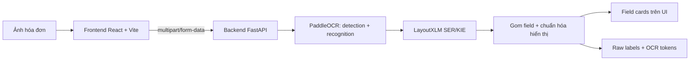
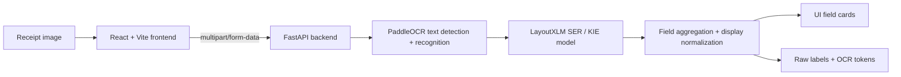

# FinRecon Receipt Extraction

> OCR + Key Information Extraction workbench for Vietnamese retail receipts.
>
> Công cụ thử nghiệm OCR + trích xuất thông tin chính cho ảnh hóa đơn/phiếu bán lẻ Việt Nam.

## Mục Lục

- [Tiếng Việt](#tiếng-việt)
  - [Tổng quan](#tổng-quan)
  - [Bài toán dự án giải quyết](#bài-toán-dự-án-giải-quyết)
  - [Ứng dụng hiện tại](#ứng-dụng-hiện-tại)
  - [Kiến trúc hệ thống](#kiến-trúc-hệ-thống)
  - [Công nghệ sử dụng](#công-nghệ-sử-dụng)
  - [Pipeline model](#pipeline-model)
  - [Dataset và chiến lược dữ liệu](#dataset-và-chiến-lược-dữ-liệu)
  - [Cấu trúc thư mục](#cấu-trúc-thư-mục)
  - [Cách chạy local](#cách-chạy-local)
  - [API chính](#api-chính)
  - [Quy trình train](#quy-trình-train)
  - [Metrics hiện tại](#metrics-hiện-tại)
  - [Chính sách quản lý artifact](#chính-sách-quản-lý-artifact)
  - [Giới hạn hiện tại](#giới-hạn-hiện-tại)
  - [Roadmap](#roadmap)
- [English](#english)
  - [Overview](#overview)
  - [Problem Statement](#problem-statement)
  - [Current Application](#current-application)
  - [System Architecture](#system-architecture)
  - [Technology Stack](#technology-stack)
  - [Model Pipeline](#model-pipeline)
  - [Dataset Strategy](#dataset-strategy)
  - [Repository Structure](#repository-structure)
  - [Run Locally](#run-locally)
  - [API Reference](#api-reference)
  - [Training Workflow](#training-workflow)
  - [Current Metrics](#current-metrics)
  - [Artifact Policy](#artifact-policy)
  - [Limitations](#limitations)
  - [Roadmap](#roadmap-1)

---

# Tiếng Việt

## Tổng quan

FinRecon Receipt Extraction là một workbench phục vụ thử nghiệm OCR và Key Information Extraction cho ảnh hóa đơn/phiếu bán lẻ Việt Nam. Dự án tập trung vào một bài toán hẹp nhưng quan trọng: từ ảnh đầu vào, hệ thống đọc chữ bằng OCR, phân loại các dòng/token bằng model KIE/SER, sau đó trích xuất 4 trường nghiệp vụ chính.

Các field hiện tại:

| Field | Ý nghĩa |
| --- | --- |
| `SELLER` | Tên cửa hàng, đơn vị bán hàng, merchant hoặc doanh nghiệp bán |
| `ADDRESS` | Địa chỉ đơn vị bán |
| `TIMESTAMP` | Ngày bán hoặc thời điểm giao dịch |
| `TOTAL_COST` | Tổng số tiền thanh toán |

Phiên bản hiện tại đã được thu hẹp khỏi ý tưởng ban đầu về invoice automation và bank reconciliation. Mục tiêu trước mắt là kiểm chứng chất lượng OCR/KIE một cách trung thực trước khi xây các workflow tài chính lớn hơn ở phía trên.

## Bài toán dự án giải quyết

Hóa đơn bán lẻ Việt Nam thường khó đọc bằng OCR thông thường vì:

- Ảnh chụp từ điện thoại có thể mờ, nghiêng, thiếu sáng hoặc bị nén.
- Hóa đơn in nhiệt thường có chữ nhỏ, nhòe, mất nét hoặc phai màu.
- Tiếng Việt có dấu dễ bị OCR đọc mất dấu hoặc nhầm ký tự.
- Layout thay đổi nhiều giữa các cửa hàng.
- Field quan trọng thường đi cùng từ khóa ngữ cảnh như `Ngày bán`, `Thời gian`, `Tổng cộng`, `Thanh toán`, `Địa chỉ`.

Dự án tách bài toán thành hai tầng rõ ràng:

- **OCR:** phát hiện vùng chữ và nhận diện nội dung chữ trên ảnh.
- **KIE/SER:** phân loại từng token/dòng text thành field nghiệp vụ.

Cách tách này giúp phân tích lỗi rõ hơn. Nếu text bị đọc sai, lỗi thường nằm ở OCR recognition. Nếu text đọc đúng nhưng field bị gán sai, lỗi thường nằm ở KIE/SER.

## Ứng dụng hiện tại

Web app hiện là một giao diện thử nghiệm inference, không phải full SaaS.

Chức năng chính:

- Upload ảnh hóa đơn/phiếu bán lẻ.
- Preview ảnh đầu vào.
- Chọn OCR engine.
- Chọn KIE/SER model.
- Hiển thị 4 field đã trích xuất.
- Hiển thị raw SER output để debug.
- Hiển thị bảng OCR tokens.
- Xóa file upload và kết quả inference tạm thời.

Nguyên tắc quan trọng:

> Đường inference kiểm thử model không dùng fallback regex hoặc rule-based extraction để “làm đẹp” kết quả.

Hệ thống chỉ post-process nhẹ ở tầng hiển thị. Ví dụ nếu model gán nhãn dòng `Ngày bán 23/08/2022 5:01:08CH` là `TIMESTAMP`, UI có thể hiển thị phần ngày/giờ chính, nhưng raw token và raw label vẫn được giữ để đánh giá trung thực.

## Kiến trúc hệ thống



Trách nhiệm từng tầng:

| Tầng | Vai trò |
| --- | --- |
| Frontend | Upload ảnh, chọn pipeline, hiển thị field và raw output |
| Backend | Nhận ảnh, quản lý file tạm, gọi OCR/KIE pipeline, chuẩn hóa response |
| PaddleOCR | Text detection và text recognition |
| LayoutXLM/SER | Gán nhãn field cho token/dòng text |
| Scripts | Chuẩn bị dataset, train, evaluate, track metrics |

## Công nghệ sử dụng

Frontend:

- React 19
- Vite
- Tailwind CSS
- lucide-react

Backend:

- FastAPI
- Uvicorn
- Python
- Local file storage cho upload và inference output tạm thời

Machine Learning:

- PaddleOCR
- PaddlePaddle
- PaddleNLP
- LayoutXLM cho SER/KIE
- Dataset MC-OCR 2021 cho chuẩn bị dữ liệu và fine-tuning

Tooling:

- PowerShell scripts cho workflow train trên Windows
- Môi trường Python riêng cho backend và PaddleOCR
- Cache Paddle/PaddleNLP/HuggingFace được chuyển vào thư mục `.cache/` trong project để tránh đầy ổ hệ thống

## Pipeline model

Pipeline inference gồm 2 lựa chọn độc lập: OCR engine và KIE/SER engine.

### OCR engines

| Tên trên UI | API value | Mục đích |
| --- | --- | --- |
| PaddleOCR package default | `paddleocr_original` | Baseline theo cấu hình mặc định của package PaddleOCR |
| PP-OCRv4 Chinese pretrained | `paddleocr_pretrained` | Official pretrained `lang=ch`; dùng để so sánh, không tối ưu cho tiếng Việt có dấu |
| PP-OCRv4 Vietnamese/Latin pretrained | `paddleocr_vi_pretrained` | Official OCR hướng Latin/Vietnamese; phù hợp hơn cho tiếng Việt |
| PaddleOCR detection + VietOCR recognition | `paddleocr_vietocr` | PaddleOCR detect bbox, VietOCR đọc text crop trong env riêng `.venvs/vietocr` |

### KIE/SER engines

| Tên trên UI | API value | Mục đích |
| --- | --- | --- |
| LayoutXLM pretrained baseline | `kie_pretrained` | Baseline/debug, chưa fine-tune theo 4 field của project |
| LayoutXLM-SER fine-tuned | `kie_trained` | Checkpoint đã fine-tune cho `SELLER`, `ADDRESS`, `TIMESTAMP`, `TOTAL_COST` |

### OCR và KIE khác nhau như thế nào?

- PaddleOCR chịu trách nhiệm đọc text từ ảnh.
- LayoutXLM/SER chịu trách nhiệm quyết định text đó thuộc field nào.

Ví dụ:

- Nếu `Số tiền` bị đọc thành `So tien`, lỗi nằm ở OCR.
- Nếu `So tien thanh toan 709.000` đọc đúng nhưng bị gán `OTHER`, lỗi nằm ở KIE/SER.
- Nếu model gán đúng `TOTAL_COST` và UI chỉ hiển thị `709.000`, đó là post-processing hiển thị, không phải fallback tính toán.

## Dataset và chiến lược dữ liệu

Dự án sử dụng dữ liệu được chuẩn bị từ MC-OCR 2021 cho các thí nghiệm receipt understanding.

Label set:

```text
OTHER
SELLER
ADDRESS
TIMESTAMP
TOTAL_COST
```

Chính sách dữ liệu:

- Dataset gốc được giữ read-only dưới `archive/source_mcocr/`.
- Dataset đã chuẩn bị được sinh dưới `archive/prepared/`.
- Giữ cả dòng value và dòng context nếu hữu ích cho KIE.
- Không demote `TOTAL_COST` chỉ vì dòng không chứa số tiền.
- Không demote `TIMESTAMP` chỉ vì dòng không chứa ngày/giờ.
- Chỉ loại annotation thật sự lỗi như text rỗng hoặc geometry/bbox không hợp lệ.

Điều này quan trọng vì các dòng context như `Tổng cộng`, `Thanh toán`, `Ngày bán`, `Thời gian` có thể giúp model hiểu field ở vùng lân cận.

## Cấu trúc thư mục

```text
.
|-- backend/
|   |-- app/
|   |   |-- main.py
|   |   `-- services/
|   |       `-- kie_model.py
|   |-- data/                  # ignored: uploads và inference outputs
|   |-- package.json
|   `-- requirements.txt
|-- frontend/
|   |-- src/
|   |   |-- App.jsx
|   |   |-- main.jsx
|   |   `-- styles.css
|   `-- package.json
|-- scripts/
|   |-- datasets/              # build/export/validate dataset
|   |-- evaluation/            # offline evaluation helpers
|   |-- inference/             # runtime bridge scripts, e.g. VietOCR recognition
|   `-- training/
|       `-- paddleocr/         # train/eval/GPU/metrics scripts
|-- archive/
|   |-- README.md
|   |-- source_mcocr/          # ignored: raw dataset
|   |-- prepared/              # ignored: prepared datasets, logs, checkpoints
|   `-- models/                # ignored: exported inference models
|-- external/
|   `-- PaddleOCR/             # ignored: local PaddleOCR runtime
|-- CODEX.md                   # context nội bộ cho AI agent
|-- PADDLEOCR_ENV.md           # ghi chú môi trường PaddleOCR
`-- README.md                  # README public cho GitHub
```

README root này dành cho người đọc trên GitHub. Các file như `CODEX.md`, `PADDLEOCR_ENV.md`, `scripts/README.md`, `archive/README.md` dùng để lưu context làm việc nội bộ và hướng dẫn chi tiết cho AI agent/dev workflow.

## Cách chạy local

Ứng dụng chạy backend và frontend riêng.

### Backend

```powershell
cd "D:\Du-an\finrecon-receipt-extraction\backend"
python -m venv .venv
.\.venv\Scripts\activate
pip install -r requirements.txt
npm run dev
```

Backend:

```text
http://127.0.0.1:8000
```

FastAPI docs:

```text
http://127.0.0.1:8000/docs
```

### Frontend

```powershell
cd "D:\Du-an\finrecon-receipt-extraction\frontend"
npm install
npm run dev
```

Frontend:

```text
http://127.0.0.1:5173
```

Nếu folder local chưa được đổi tên, dùng path hiện tại thay cho `D:\Du-an\finrecon-receipt-extraction`.

## API chính

```http
GET    /api/health
GET    /api/model-options
POST   /api/scan-image
DELETE /api/scan-results
```

### `GET /api/model-options`

Trả về danh sách OCR/KIE engines, default option và trạng thái model artifact có sẵn hay không.

### `POST /api/scan-image`

Form data:

| Field | Type | Required | Mô tả |
| --- | --- | --- | --- |
| `file` | image file | yes | Ảnh `.jpg`, `.jpeg`, `.png`, `.bmp`, `.webp` |
| `ocr_engine` | string | no | Một OCR option từ `/api/model-options` |
| `kie_engine` | string | no | Một KIE option từ `/api/model-options` |

Response mẫu:

```json
{
  "file_name": "receipt.jpg",
  "preview_url": "/uploads/example.jpg",
  "ocr_engine_label": "PP-OCRv4 Vietnamese/Latin pretrained",
  "kie_engine_label": "LayoutXLM-SER fine-tuned",
  "fields": [
    {
      "label": "SELLER",
      "value": "SIÊU THỊ EVMART",
      "raw_value": "OONGLIAN SIEU THI EVMART",
      "display_value": "OONGLIAN SIEU THI EVMART"
    }
  ],
  "raw_text": "[SELLER] ...",
  "tokens": [
    {
      "text": "SIEU THI EVMART",
      "label": "SELLER",
      "points": []
    }
  ]
}
```

### `DELETE /api/scan-results`

Xóa upload tạm và output inference dưới `backend/data/`.

## Quy trình train

PaddleOCR/LayoutXLM được tách khỏi môi trường backend.

| Mục đích | Path |
| --- | --- |
| PaddleOCR GPU env | `.venvs/paddleocr-gpu` |
| VietOCR env | `.venvs/vietocr` |
| PaddleOCR source | `external/PaddleOCR` |
| Project cache | `.cache/` |
| KIE/SER export | `archive/prepared/finrecon_receipt_4field_clean/paddleocr_ser` |

Tất cả script train nên load:

```powershell
.\scripts\training\paddleocr\env.ps1
```

Script này chuyển cache của Paddle/PaddleNLP/HuggingFace/pip/temp vào `.cache/` trong project.

### 1. Kiểm tra GPU

```powershell
.\scripts\training\paddleocr\gpu_check.ps1
```

Output tốt kỳ vọng:

```text
cuda True
gpu_count >= 1
device gpu:0
PaddlePaddle works well on 1 GPU
```

### 2. Chuẩn bị dataset KIE/SER

```powershell
python scripts\datasets\prepare_receipt_4field_dataset.py --clear --copy-mode hardlink
python scripts\datasets\clean_receipt_4field_dataset.py --clear --copy-mode hardlink
python scripts\datasets\export_paddleocr_ser_dataset.py --dataset-dir archive\prepared\finrecon_receipt_4field_clean --output-dir archive\prepared\finrecon_receipt_4field_clean\paddleocr_ser --copy-mode hardlink --epoch-num 10 --eval-step 250 --batch-size 2 --learning-rate 0.00002 --warmup-epoch 1 --clip-norm-global 1.0
python scripts\datasets\validate_paddleocr_ser_dataset.py --dataset-dir archive\prepared\finrecon_receipt_4field_clean\paddleocr_ser
```

### 3. Train LayoutXLM/SER

```powershell
.\scripts\training\kie_layoutxlm\train_gpu.ps1
```

Evaluate checkpoint:

```powershell
.\scripts\training\kie_layoutxlm\eval_ser.ps1 -Split test -UseGpu
```

### 4. Huong OCR tiep theo

Pipeline OCR moi duoc tach thanh hai bai toan rieng:

- PaddleOCR detection fine-tuning: cai thien viec tim bbox/text line tren hoa don ban le Viet Nam.
- VietOCR recognition fine-tuning: cai thien viec doc tieng Viet co dau tren tung crop da detect.

Cac script va artifact PaddleOCR text-recognition cu da duoc go bo de tranh nham voi huong detection + VietOCR.

### 5. Apply runtime patches

`external/PaddleOCR/` không được commit. Sau khi clone/cài lại PaddleOCR, chạy:

```powershell
.\scripts\training\paddleocr\apply_runtime_patches.ps1
```

## Metrics hiện tại

### KIE/SER

Checkpoint LayoutXLM/SER hiện được giữ:

```text
archive/prepared/finrecon_receipt_4field_clean/paddleocr_ser/output/ser_vi_layoutxlm_finrecon_4field/best_accuracy
```

| Split | Precision | Recall | F1 / Hmean |
| --- | ---: | ---: | ---: |
| Validation | 0.9472259811 | 0.9549795362 | 0.9510869565 |
| Test | 0.9069462647 | 0.9153439153 | 0.9111257406 |

Kết luận:

- Checkpoint 10 epoch đang là KIE checkpoint tốt nhất được giữ.
- Các lần continuation sau đó không cải thiện validation F1 nên đã được loại bỏ.
- Chỉ nên retrain KIE khi có thay đổi dataset, label policy hoặc failure pattern rõ ràng.

### OCR direction

The previous integrated PaddleOCR text-recognition experiment was removed. OCR work now targets PaddleOCR detection plus VietOCR recognition, tracked as separate experiments with separate metrics.

## Chính sách quản lý artifact

Các artifact nặng không được commit lên Git.

Ignored mặc định:

```text
.venv/
.venvs/
.cache/
backend/data/
frontend/node_modules/
frontend/dist/
external/PaddleOCR/
archive/source_mcocr/
archive/prepared/
archive/models/
```

Nên commit:

- Source code frontend/backend.
- Script dataset/training/evaluation.
- Tài liệu nhẹ.
- Config template.
- Report nhỏ cần thiết cho tracking.

Không nên commit:

- Raw dataset.
- Generated samples.
- Checkpoint PaddleOCR/LayoutXLM.
- Exported inference models.
- Cache train.
- Upload tạm.

## Giới hạn hiện tại

- OCR fine-tuned recognizer vẫn đang ở mức thử nghiệm.
- Nhận diện tiếng Việt có dấu chưa ổn định trên ảnh thật.
- Chưa có annotation correction UI.
- Chưa có trang benchmark field-level trong web app.
- Model artifacts cần được restore riêng sau khi clone repo.
- App hiện chỉ tập trung vào receipt extraction, chưa quay lại workflow invoice approval hoặc bank reconciliation.

## Roadmap

Ưu tiên tiếp theo:

1. Tạo held-out evaluation set từ ảnh hóa đơn thật.
2. Benchmark tất cả tổ hợp OCR/KIE trên cùng tập ảnh.
3. Track CER/WER cho OCR và field-level F1 cho KIE.
4. Train tiếp OCR recognition với augmentation cho ảnh mờ, nén JPEG, low contrast, thermal receipt noise.
5. Thêm error analysis UI: false positive, false negative, OCR confusion, SER confusion.
6. Thêm annotation review để sửa ground truth.
7. Chuẩn hóa cách đóng gói model artifacts để setup local dễ hơn.
8. Khi extraction ổn định, mở rộng lên workflow tài chính như purchase review, payable audit hoặc reconciliation.

---

# English

## Overview

FinRecon Receipt Extraction is an OCR and Key Information Extraction workbench for Vietnamese retail receipt images. The project focuses on one practical computer vision problem: upload a receipt image, read text with OCR, classify OCR tokens with a KIE/SER model, and extract four business fields.

Current extraction targets:

| Field | Meaning |
| --- | --- |
| `SELLER` | Seller, merchant, store, or business name |
| `ADDRESS` | Seller address |
| `TIMESTAMP` | Transaction date or date/time |
| `TOTAL_COST` | Total paid amount |

The current version is intentionally scoped to model evaluation and field extraction. Earlier invoice automation, bank reconciliation, sample generation, and finance dashboard workflows have been removed from the active application so the project can focus on OCR/KIE quality first.

## Problem Statement

Vietnamese retail receipts are difficult for generic OCR systems:

- Images are often captured from phones and may be blurred, skewed, compressed, or low contrast.
- Thermal receipts may have small, faded, or noisy text.
- Vietnamese diacritics are frequently dropped or confused.
- Receipt layouts vary heavily across merchants.
- Important fields often appear near context keywords such as `Ngày bán`, `Thời gian`, `Tổng cộng`, `Thanh toán`, or `Địa chỉ`.

The project separates the problem into two stages:

- **OCR:** detect text regions and recognize text content.
- **KIE/SER:** classify each token or line into a business field.

This makes error analysis cleaner. If the recognized text is wrong, the issue is usually OCR recognition. If the text is correct but assigned to the wrong field, the issue is usually KIE/SER.

## Current Application

The web app is a single-page inference workbench.

Main features:

- Receipt image upload with preview.
- OCR engine selector.
- KIE/SER model selector.
- Four field cards for `SELLER`, `ADDRESS`, `TIMESTAMP`, and `TOTAL_COST`.
- Raw SER output panel.
- OCR token table.
- Temporary upload/inference cleanup.

Core principle:

> The model test path does not use fallback regex or hand-written extraction rules to hide model errors.

Only lightweight display normalization is applied. For example, if the model labels a full line such as `Ngày bán 23/08/2022 5:01:08CH` as `TIMESTAMP`, the UI can display the date/time value while preserving the raw token and raw label for debugging.

## System Architecture



Runtime responsibilities:

| Layer | Responsibility |
| --- | --- |
| Frontend | Upload image, select models, show fields and raw output |
| Backend | Receive image, manage temporary files, call OCR/KIE pipeline, normalize response |
| PaddleOCR | Text detection and text recognition |
| LayoutXLM/SER | Token-level field classification |
| Scripts | Dataset preparation, training, evaluation, and metric tracking |

## Technology Stack

Frontend:

- React 19
- Vite
- Tailwind CSS
- lucide-react

Backend:

- FastAPI
- Uvicorn
- Python
- Local file storage for temporary uploads and inference outputs

Machine Learning:

- PaddleOCR
- PaddlePaddle
- PaddleNLP
- LayoutXLM for SER/KIE
- MC-OCR 2021 based data preparation

Tooling:

- PowerShell scripts for Windows training workflows
- Separate Python environments for backend and PaddleOCR
- Project-local cache redirection for Paddle, PaddleNLP, HuggingFace, pip, and temp files

## Model Pipeline

The inference pipeline has two independent choices: OCR engine and KIE/SER engine.

### OCR engines

| UI label | API value | Purpose |
| --- | --- | --- |
| PaddleOCR package default | `paddleocr_original` | Package-level PaddleOCR baseline |
| PP-OCRv4 Chinese pretrained | `paddleocr_pretrained` | Official `lang=ch` pretrained baseline; useful for comparison but weak for Vietnamese diacritics |
| PP-OCRv4 Vietnamese/Latin pretrained | `paddleocr_vi_pretrained` | Official Vietnamese/Latin-oriented OCR option |
| PaddleOCR detection + VietOCR recognition | `paddleocr_vietocr` | PaddleOCR detects text boxes, while VietOCR recognizes crop text in the isolated `.venvs/vietocr` environment |

### KIE/SER engines

| UI label | API value | Purpose |
| --- | --- | --- |
| LayoutXLM pretrained baseline | `kie_pretrained` | Baseline/debug option without project-specific 4-field fine-tuning |
| LayoutXLM-SER fine-tuned | `kie_trained` | Project checkpoint fine-tuned for `SELLER`, `ADDRESS`, `TIMESTAMP`, and `TOTAL_COST` |

### OCR vs KIE

- PaddleOCR reads text from image regions.
- LayoutXLM/SER decides which business field each recognized token belongs to.

Examples:

- If `Số tiền` is read as `So tien`, the issue is OCR recognition.
- If `So tien thanh toan 709.000` is read correctly but labeled as `OTHER`, the issue is KIE/SER.
- If the model labels `So tien thanh toan 709.000` as `TOTAL_COST` and the UI displays `709.000`, that is display normalization, not model cheating.

## Dataset Strategy

The project uses MC-OCR 2021 derived data for receipt understanding experiments.

Label set:

```text
OTHER
SELLER
ADDRESS
TIMESTAMP
TOTAL_COST
```

Dataset policy:

- Keep the raw MC-OCR dataset read-only under `archive/source_mcocr/`.
- Build prepared datasets under `archive/prepared/`.
- Keep both value lines and useful context lines for KIE.
- Do not demote `TOTAL_COST` only because a line has no amount.
- Do not demote `TIMESTAMP` only because a line has no date/time.
- Remove only genuinely unusable annotations such as empty text or invalid geometry.

This matters because context lines such as `Tổng cộng`, `Thanh toán`, `Ngày bán`, and `Thời gian` help the model understand nearby values.

## Repository Structure

```text
.
|-- backend/
|   |-- app/
|   |   |-- main.py
|   |   `-- services/
|   |       `-- kie_model.py
|   |-- data/                  # ignored: uploads and inference outputs
|   |-- package.json
|   `-- requirements.txt
|-- frontend/
|   |-- src/
|   |   |-- App.jsx
|   |   |-- main.jsx
|   |   `-- styles.css
|   `-- package.json
|-- scripts/
|   |-- datasets/              # dataset build/export/validation scripts
|   |-- evaluation/            # offline evaluation helpers
|   |-- inference/             # runtime bridge scripts, e.g. VietOCR recognition
|   `-- training/
|       `-- paddleocr/         # train/eval/GPU/metrics scripts
|-- archive/
|   |-- README.md
|   |-- source_mcocr/          # ignored: raw dataset
|   |-- prepared/              # ignored: prepared datasets, logs, checkpoints
|   `-- models/                # ignored: exported inference models
|-- external/
|   `-- PaddleOCR/             # ignored: local PaddleOCR runtime
|-- CODEX.md                   # internal AI-agent context
|-- PADDLEOCR_ENV.md           # PaddleOCR environment notes
`-- README.md                  # public GitHub README
```

The root README is for GitHub readers. Internal working context lives in `CODEX.md`, `PADDLEOCR_ENV.md`, `scripts/README.md`, and `archive/README.md`.

## Run Locally

The backend and frontend are designed to run separately.

### Backend

```powershell
cd "D:\Du-an\finrecon-receipt-extraction\backend"
python -m venv .venv
.\.venv\Scripts\activate
pip install -r requirements.txt
npm run dev
```

Backend:

```text
http://127.0.0.1:8000
```

FastAPI docs:

```text
http://127.0.0.1:8000/docs
```

### Frontend

```powershell
cd "D:\Du-an\finrecon-receipt-extraction\frontend"
npm install
npm run dev
```

Frontend:

```text
http://127.0.0.1:5173
```

If the local folder has not been renamed yet, use the current folder path instead of `D:\Du-an\finrecon-receipt-extraction`.

## API Reference

```http
GET    /api/health
GET    /api/model-options
POST   /api/scan-image
DELETE /api/scan-results
```

### `GET /api/model-options`

Returns available OCR/KIE engines, default options, and local artifact availability.

### `POST /api/scan-image`

Form data:

| Field | Type | Required | Description |
| --- | --- | --- | --- |
| `file` | image file | yes | `.jpg`, `.jpeg`, `.png`, `.bmp`, `.webp` |
| `ocr_engine` | string | no | One OCR option from `/api/model-options` |
| `kie_engine` | string | no | One KIE option from `/api/model-options` |

Example response:

```json
{
  "file_name": "receipt.jpg",
  "preview_url": "/uploads/example.jpg",
  "ocr_engine_label": "PP-OCRv4 Vietnamese/Latin pretrained",
  "kie_engine_label": "LayoutXLM-SER fine-tuned",
  "fields": [
    {
      "label": "SELLER",
      "value": "SIÊU THỊ EVMART",
      "raw_value": "OONGLIAN SIEU THI EVMART",
      "display_value": "OONGLIAN SIEU THI EVMART"
    }
  ],
  "raw_text": "[SELLER] ...",
  "tokens": [
    {
      "text": "SIEU THI EVMART",
      "label": "SELLER",
      "points": []
    }
  ]
}
```

### `DELETE /api/scan-results`

Deletes temporary uploads and inference outputs under `backend/data/`.

## Training Workflow

PaddleOCR/LayoutXLM training is separated from the backend environment.

| Purpose | Path |
| --- | --- |
| PaddleOCR GPU environment | `.venvs/paddleocr-gpu` |
| VietOCR environment | `.venvs/vietocr` |
| PaddleOCR source | `external/PaddleOCR` |
| Project cache | `.cache/` |
| KIE/SER export | `archive/prepared/finrecon_receipt_4field_clean/paddleocr_ser` |

All training scripts should load:

```powershell
.\scripts\training\paddleocr\env.ps1
```

This redirects Paddle, PaddleNLP, HuggingFace, pip, and temp cache into the project `.cache/` folder.

### 1. Check GPU

```powershell
.\scripts\training\paddleocr\gpu_check.ps1
```

Expected healthy output:

```text
cuda True
gpu_count >= 1
device gpu:0
PaddlePaddle works well on 1 GPU
```

### 2. Prepare KIE/SER dataset

```powershell
python scripts\datasets\prepare_receipt_4field_dataset.py --clear --copy-mode hardlink
python scripts\datasets\clean_receipt_4field_dataset.py --clear --copy-mode hardlink
python scripts\datasets\export_paddleocr_ser_dataset.py --dataset-dir archive\prepared\finrecon_receipt_4field_clean --output-dir archive\prepared\finrecon_receipt_4field_clean\paddleocr_ser --copy-mode hardlink --epoch-num 10 --eval-step 250 --batch-size 2 --learning-rate 0.00002 --warmup-epoch 1 --clip-norm-global 1.0
python scripts\datasets\validate_paddleocr_ser_dataset.py --dataset-dir archive\prepared\finrecon_receipt_4field_clean\paddleocr_ser
```

### 3. Train LayoutXLM/SER

```powershell
.\scripts\training\kie_layoutxlm\train_gpu.ps1
```

Evaluate checkpoint:

```powershell
.\scripts\training\kie_layoutxlm\eval_ser.ps1 -Split test -UseGpu
```

### 4. Next OCR direction

The OCR pipeline is now split into two separate training targets:

- PaddleOCR detection fine-tuning: improve text box/text line detection on Vietnamese retail receipts.
- VietOCR recognition fine-tuning: improve Vietnamese text transcription on detected crops.

The previous PaddleOCR text-recognition scripts and artifacts were removed to avoid mixing that experiment with the new detection + VietOCR direction.

### 5. Apply runtime patches

`external/PaddleOCR/` is not committed. After restoring or refreshing PaddleOCR, run:

```powershell
.\scripts\training\paddleocr\apply_runtime_patches.ps1
```

## Current Metrics

### KIE/SER

Current kept LayoutXLM/SER checkpoint:

```text
archive/prepared/finrecon_receipt_4field_clean/paddleocr_ser/output/ser_vi_layoutxlm_finrecon_4field/best_accuracy
```

| Split | Precision | Recall | F1 / Hmean |
| --- | ---: | ---: | ---: |
| Validation | 0.9472259811 | 0.9549795362 | 0.9510869565 |
| Test | 0.9069462647 | 0.9153439153 | 0.9111257406 |

Interpretation:

- The 10-epoch checkpoint is the best currently kept KIE model.
- Later continuation attempts did not improve validation F1 and were removed.
- Further KIE training should be driven by clear dataset, label policy, or failure pattern changes.

### OCR direction

The previous integrated PaddleOCR text-recognition experiment was removed. OCR work now targets PaddleOCR detection plus VietOCR recognition, tracked as separate experiments with separate metrics.

## Artifact Policy

Large artifacts are intentionally not committed to Git.

Ignored by default:

```text
.venv/
.venvs/
.cache/
backend/data/
frontend/node_modules/
frontend/dist/
external/PaddleOCR/
archive/source_mcocr/
archive/prepared/
archive/models/
```

Commit:

- Frontend/backend source code.
- Dataset, training, and evaluation scripts.
- Lightweight documentation.
- Configuration templates.
- Small tracking reports when useful.

Do not commit:

- Raw datasets.
- Generated samples.
- PaddleOCR/LayoutXLM checkpoints.
- Exported inference models.
- Training cache.
- Temporary uploads.

## Limitations

- The fine-tuned OCR recognizer is still experimental.
- Vietnamese diacritic recognition is not yet stable on real receipt images.
- There is no annotation correction UI yet.
- There is no in-app field-level benchmark page yet.
- Model artifacts must be restored separately after cloning.
- The app currently focuses on receipt extraction only, not invoice approval or bank reconciliation.

## Roadmap

Recommended next steps:

1. Build a held-out evaluation set from real receipt images.
2. Benchmark all OCR/KIE combinations on the same image set.
3. Track OCR CER/WER and KIE field-level F1 separately.
4. Continue OCR recognition training with augmentation for blur, JPEG compression, low contrast, and thermal receipt noise.
5. Add an error analysis UI: false positives, false negatives, OCR confusion, and SER confusion.
6. Add annotation review for ground-truth correction.
7. Standardize model artifact packaging for easier local setup.
8. Once extraction quality is stable, expand toward finance workflows such as purchase review, payable audit, or reconciliation.

## Recommended Repository Name

```text
finrecon-receipt-extraction
```

The name is intentionally shorter and more accurate than the original invoice automation title because the active project now focuses on receipt OCR and field extraction.
